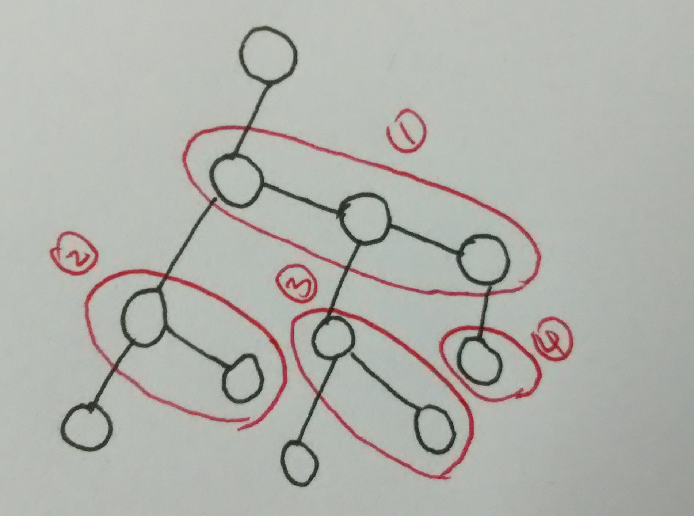

# 森林和二叉树的相互转换 #

## 介绍 ##
    	
    	二叉树是树的一种，森林是树的集合，所以森林和二叉树之间的转换就是树和二叉树之间的转换。
    
    	下文将讨论森林转换为二叉树和二叉树转换为森林：
    
    	根据树与二叉树中结点的对应关系：
    	
|   | 树 | 二叉树 |
| :--: | :--: | :--: |
| 结点关系 | 兄弟关系 | 双亲和右孩子 |
| 结点关系 | 双亲和长子 | 双亲和左孩子 |
	
    	可以得到以下的转换方法，接着就是恰当地选取存储结构设计算法用程序化语言实现下面的转换。
    
	    1. 森林转换为二叉树
	    1.1 连线：
		把每株树的各兄弟结点连起来；
		把各株树的根结点连起来（视为兄弟）
	    1.2 抹线：
		对于每个结点，只保留与其最左儿子的连线，抹去该结点与其它结点之间的连线
	    1.3 旋转：
	 	按顺时针旋转45度角（左链竖画，右链横画）
	 	
	    2. 二叉树转换为森林
	    2.1 连线：
		若某个结点k 是其双亲结点的左孩子，则将该结点k 的右孩子以及（当且仅当）
		连续地沿着右孩子的右链不断搜索到的所有右孩子，都分别与结点k 的双亲结点相连；
	    2.2 抹线：
		把二叉树中的所有结点与其右孩子的连线以及（当且仅当）连续地沿着右孩子的右链不断搜索到的所有右孩子的连线全部抹去;
	    2.3	旋转：
		按逆时针旋转45度角（即把结点按层次排列）
		
	
		程序的输入是读文件形式的，用于测试的二叉树和森林的相关数据已经存储在文件中。
    
   
   
    
## 数据结构 ##
### 森林转换为二叉树 ###
* **森林的存储结构**
	
		树的存储结构是二维数组，行列数均为树的结点总数，如果结点 i 和 j 之间有边，
		则对应二维数组 root[i][j].key 置为 1， 否则置为 0。
	```c
	struct treenode{
		datatype data;
		int key;
	};
	typedef struct treenode nodetype;
	
	struct treetype{
		//nodetype (*root)[MAXSIZE];
		nodetype root[MAXSIZE][MAXSIZE];
		int row;		
		int column;
		int side;		//树的边数
	};
	
	struct FOREST{
		struct treetype treearray[MAXTREENUM];        
		int treenum;
	};
	typedef struct FOREST * forest;
	```
* **二叉树的存储结构**

	```c
	struct node{
		datatype data;
		struct node * lchild;
		struct node * rchild;
	};
	typedef struct node * btree;
	```


### 二叉树转换为森林 ###

* **森林的存储结构**

		这里，森林中的树采取的是双亲表示法（单练表示、父链表示），树的双亲表示法实质上是一个静态链表。
		存储特点是将每个节点层序地存储在一维数组里，同时记录其唯一双亲结点的下标和紧挨着的兄弟节点的下标。
	```c
	struct treenode{
		char data;
		int parent;
		int firstchild;
		int rightsib;
	};
	typedef struct treenode tree;

	struct fo{
		tree treearray[MAXTREENUM][MAXSIZE];
		int treenum;					//森林中树的总数
		int treesize[MAXTREENUM];			//森林中每颗树的大小
	};
	typedef struct fo * forest;
	```

* **需要用到队列**

	```c
	struct q{
		int front;
		int rear;
		struct node * elements[MAXSIZE];  
	};
	typedef struct q * queue;
	```


## 算法介绍 ##
### 森林转换为二叉树 ###

		森林转换为二叉树实际就是将森林中的每颗树转换为二叉树，取森林中任意一棵树的根作为二叉树的根。
		设森林中树结点数目为 N ，则先初始化 N 个二叉树的结点，节点存储的数据与树中 N 个节点存储的数据完全一致。
		
		然后，森林中的树一棵一棵依次转换为二叉树。
		即，第一棵树转换为二叉树，二叉树根的右子树是空的，再将第二棵树转换为二叉树根的右子树，依此类推。
		这个过程可以先单独将每颗树转换为二叉树，然后将所得的每棵二叉树的根节点如下连接起来即可：
```c
for (i = 1; i < ft->treenum; i++){
	bt[i - 1]->rchild = bt[i];
}
```
		单独看一棵树怎么转换为二叉树：
		因为树的存储结构是二维数组，所以直接按行扫描二维数组即可，遇到两个结点之间有树边的，
		则将二叉树相对应节点的边连起来就好。
		
		主要要考虑是作为左儿子连起来还是右儿子连起来：
		根据树和二叉树之间结点的对应关系可以看出，
		扫描某一行遇到的第一条边 (i,j) 转换为 “二叉树中结点 j 是 i 的左儿子”，
		然后继续扫描遇到的边 (i,j')，转换为 “二叉树中结点 j' 是 j 的右儿子”，
		继续扫描遇到的边 (i,j'')， 转换为 “二叉树中节点 j'' 是 j' 的右儿子”，
		依此类推。
		
		由于我们事先标记了树的边数为 side，因为二叉树的边数和树的边数是一样的，
		所以可以在扫描二维数组的过程中设定一个计数变量 count，二叉树中每产生一条边，count++，
		在外层循环中添加条件 count != side 即可避免无意义的扫描（count = side 时已经转换完成无需再扫描）。
		
	
### 二叉树转换为森林 ###
		
		有了上面森林转换为二叉树的经验，实际上二叉树转换为森林就是一个逆过程而已，不过实现起来要复杂一些。
		这里树采取的存储结构是实际还是一个数组，二叉树的根作为森林的根。
		
		根据上面的转换过程，首先要将二叉树拆分，具体做法是将根节点左子树作为一棵新的二叉树，
		右子树的左子树作为一棵新的二叉树，右子树的右子树的左子树作为一棵新的二叉树...依此类推。
```c
btree *btt = (btree *)malloc(sizeof(btree) * count);
while(rbt){
	btt[i] = rbt;
	//btt[i]->rchild = NULL;
	rbt = rbt->rchild;
	i++;
}
```
		
		单独看一棵二叉树怎样转换为树：
		1. 二叉树只有根节点或者二叉树只有根节点和根节点的左儿子这两个结点的情况很容易处理；
		2. 其余情况我是这样考虑的：
		
		转换过程是按照图片1中顺序依次处理，所有可以利用队列先进先出的特点，
		每一次入队过程，都能处理入队结点的 parent 域和 rightsib 域，
		要注意的是，不处理第一个入队结点 A 的 parent 域，放在出队过程中处理，
		因为实际上在上一个循环的出队的过程中已经处理过 A 的 parent 域了，即在上一次循环中已经知道它的父亲是谁。
		这样在当前循环中，由于它的右兄弟和它是同一个父亲，就可以给右兄弟的parent域赋值了。


		要注意的是，由于根节点的左儿子是第一次入队过程的第一个入队节点，对于它没有上一次循环可言，
		所以在第一次出队的时候，要单独处理一下二叉树根节点的左儿子的右儿子序列的 parent 域。
		
		各个域的赋值要注意的是：
		因为结点的编号是从1开始的，所以如果没有父亲或右儿子或左儿子，对应域置为0即可。
		

		
		

## 复杂度分析 ##
* **树转换为二叉树**
		
		设树的边数为 S，树的顶点数为 P，显见的是算法过程中两层循环，则时间复杂度为 O(S*P)。

* **二叉树转换为树**

		设二叉树的顶点数为 P，由于二叉树每个顶点只出入队一次，所以时间复杂度为 O(P)。
		
## 展示结果 ##
		打印树的先序序列，
		树的先序遍历和二叉树的先序遍历十分类似：
```c
void preorder_tree(int i, tree t[]){
	printf("%c ", t[i].data);
	int c = t[i].firstchild;
	while (c != 0){
		preorder_tree(c, t);
		c = t[c].rightsib;
	}
}
```
		
		
		
